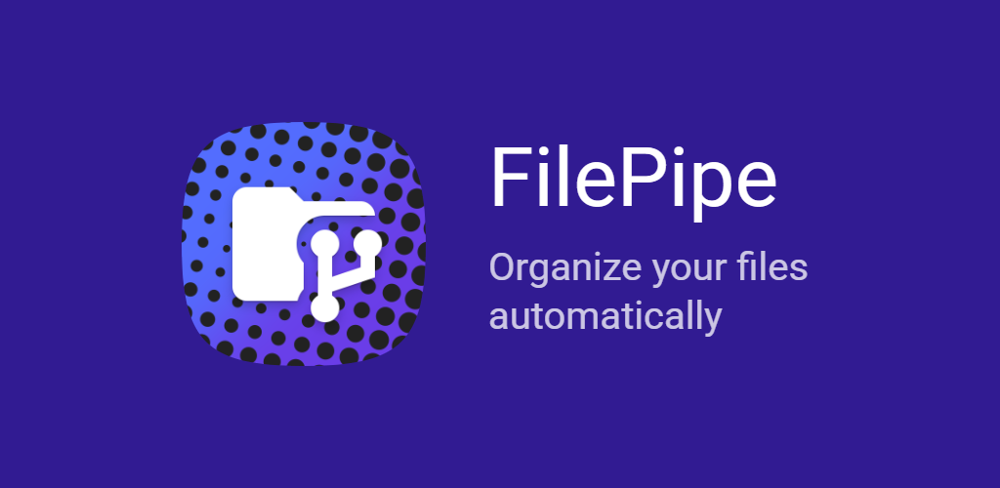
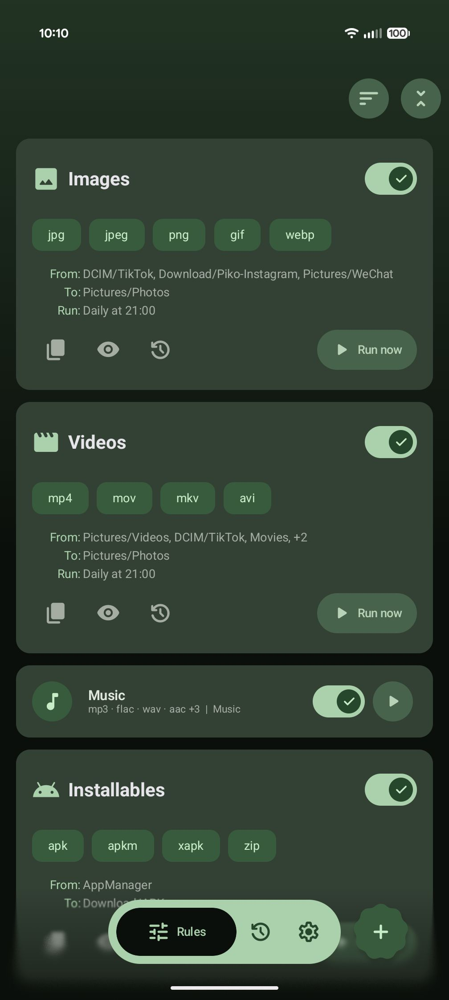
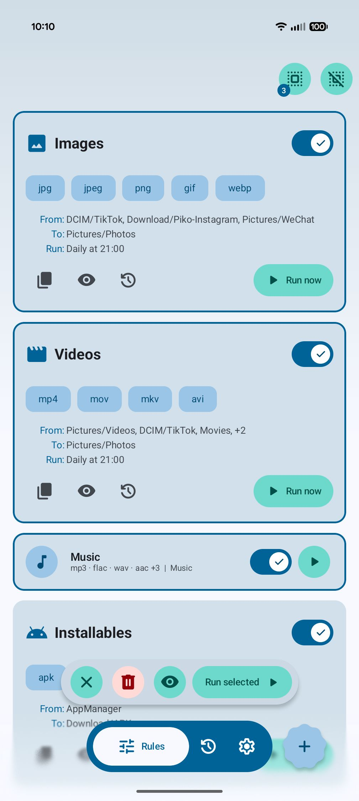
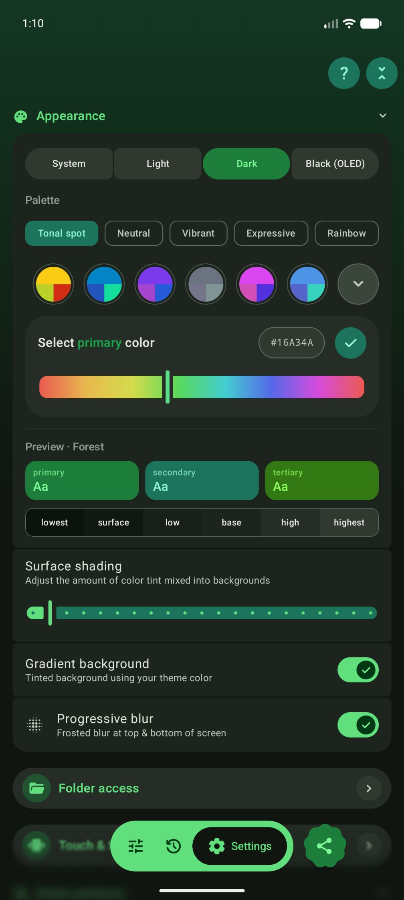
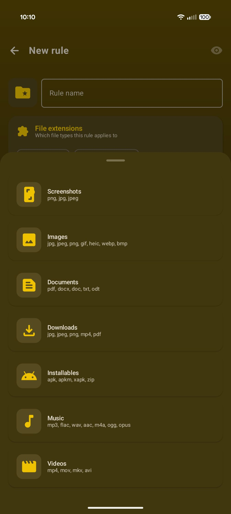
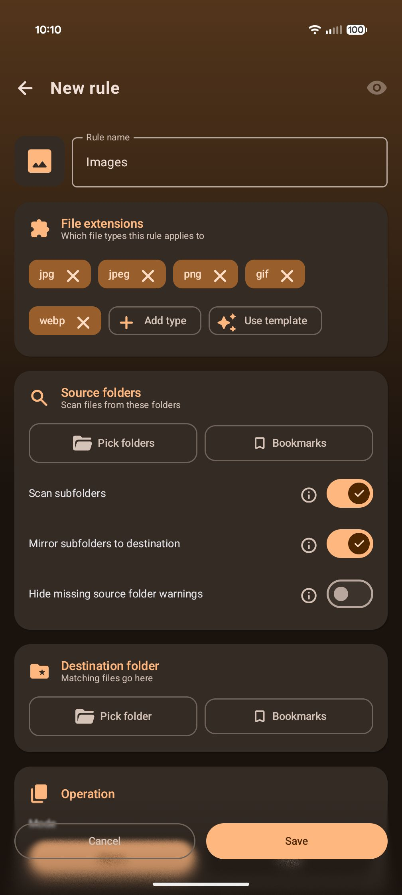
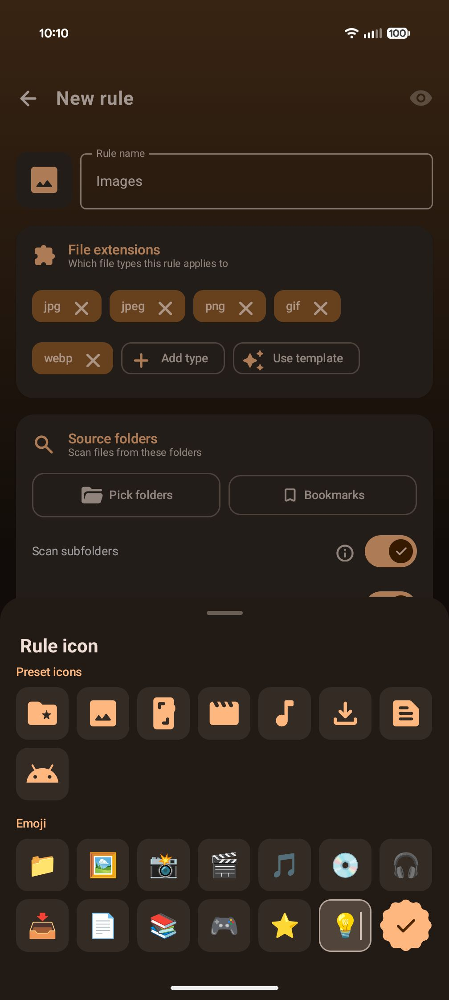
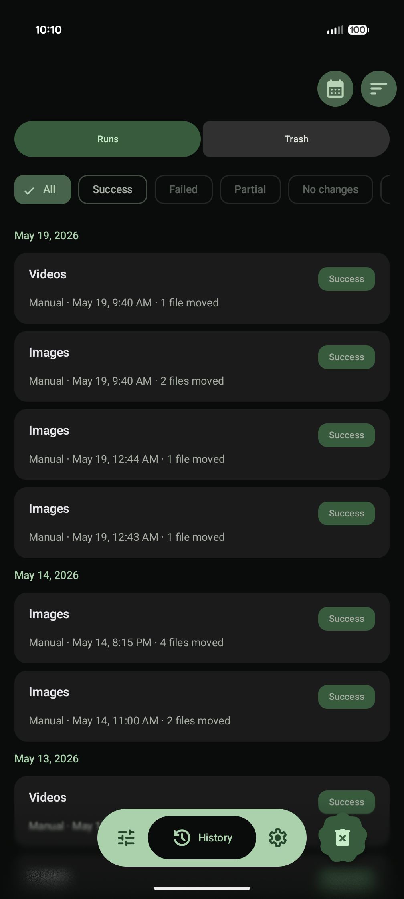
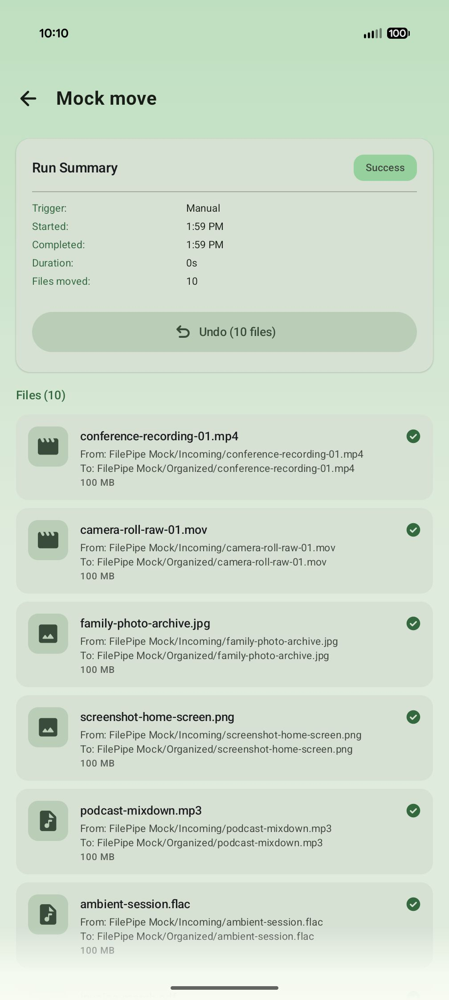

# FilePipe

FilePipe turns your chaotic storage into a perfectly organized library — automatically.

Ever wish your Downloads folder would just sort itself? Or that all your videos would gather in one place regardless of which app saved them?

That's exactly what <b>FilePipe</b> does. Set a rule, pick a schedule, and let the pipes do the work. Move or copy any media to its rightful place.

## 🛠️ How to use

1. **Choose access mode**: `Selective Access` for granular control or `All Files Access` for ease of use. 
2. **Define the Source**: Pick any folder (or multiple) and decide if you want to scan subfolders.
3. **Choose which files**: Target files by extension, size, age, or advanced name patterns.
4. **Set the Destination**: Choose where the files belong and how to handle name conflicts.
5. **Run Automate**: Run manually on-demand, or set an Hourly, Daily, or Weekly schedule.

## ✨ Key Features

### 📂 Rule-Based Automation

- **Templates**: Get started instantly with presets for screenshots, images, video, music, downloads, documents, and more.
- **Advanced Filtering**: Go beyond extensions with name patterns, wildcards, file size limits, and age-based rules.
- **Recursive Scanning**: Deep-dive into subfolders to find every matching file. Optionally mirror folder structure at the destination.
- **Action control**: Choose the action - move or copy. And conflict resolution method - skip, overwrite or rename. 

### ⚡ Power User Workflow

- **Scheduled Job Notifications**: Background jobs post summary notifications with a quick result preview and a one-tap Undo button.
- **Swipe Shortcuts**: Fully configurable gestures on rule cards for quick editing, duplicating, or checking history.
- **Home Screen Shortcuts**: Run your favorite rules instantly with long-press Launcher shortcuts.
- **Backup & Restore/Import**: Export all your rules and settings to local folder or cloud. Support for auto-exports ensures you never lose your setup. Later you can Import or restore it. 

### 📊 Visibility & Control

- **Detailed History**: Every run is logged. Filter by success, failure, or outcome to see exactly what happened. And group by date, rule, or status.
- **Drag-and-Drop**: Organize your rules exactly how you want them with a custom sort order.
- **Batch Actions**: Long-press to enter multi-select mode and preview, run or delete multiple rules at once.
- **Smart Updates**: Built-in smart update checker that detects hotfixes (newer assets) even when the version number stays the same.
- **FAQ & Help**: Searchable help page covering common questions, grouped by topic with deep links into Settings.

### 🛡️ Safety & Reliability (Multiple Fail-Safes)

- **Preview Mode**: See exactly which files will be affected before a single byte is moved. Works in batch mode too.
- **Cancel Mid-Run**: Stop any operation instantly mid-batch if you change your mind.
- **Rule Trash** - Deleted rules go to Trash for 30 days, restore from History.
- **Undo After the Fact**: Made a mistake? Reverse moves or delete copies directly from the history log.
- **Background Resiliency**: Manual runs survive app switching. FilePipe keeps working and keeps you updated via notifications.

### 🎨 Your App, Your Aesthetic

- **Material 3 Expressive**: Light/Dark/OLED themes and dynamic wallpaper-based colors.
- **Total Customization**: 8 preset colors and 9 palette algorithms. Or choose your own color from a slider with live preview. Choice of gradient background and progressive blurs.
- **Visual Personality**: Assign custom icons or emojis to every rule for easy identification.

---

## 🖼️ Screenshots

<table>
<tr>
<td width="33%" align="center" valign="top">
 
</td>
<td width="33%" align="center" valign="top">
 
</td>
<td width="33%" align="center" valign="top">
 
</td>
</tr>

<tr>
<td width="33%" align="center" valign="top">
 
</td>
<td width="33%" align="center" valign="top">
 
</td>
<td width="33%" align="center" valign="top">
 
</td>
</tr>

<tr>
<td width="33%" align="center" valign="top">
 
</td>
<td width="33%" align="center" valign="top">
 
</td>
<td width="33%" align="center" valign="top">
<video src="https://github.com/user-attachments/assets/99e8bd81-65b2-4961-908d-1d8a5a79b981" controls alt="FilePipe Intro." width="300" /> 
</td>
</tr>
</table>

---

## 📥 Download / links

- [**Play Store**](https://play.google.com/store/apps/details?id=dev.bikram.filepipe)
- [**GitHub**](https://github.com/bikram-agarwal/FilePipe/releases/latest) 

- [Project site](https://bikram-agarwal.github.io/filepipe/)
- [Privacy policy](https://bikram-agarwal.github.io/filepipe/privacy)

---

Made with ❤️ by Bikram Agarwal
