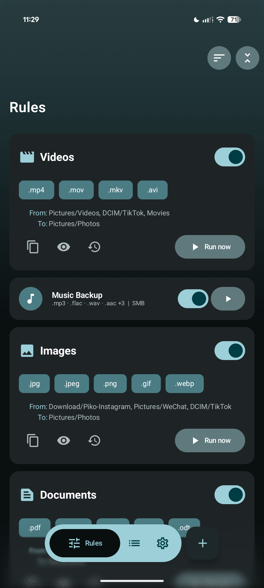
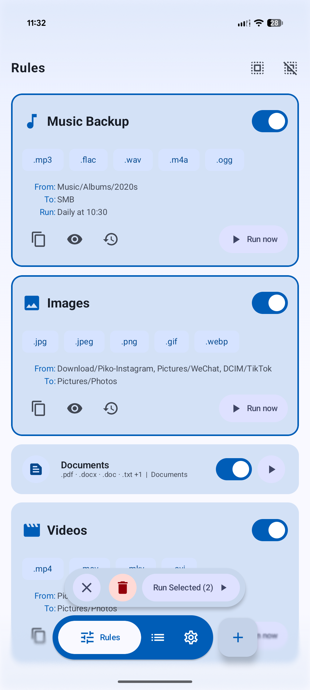
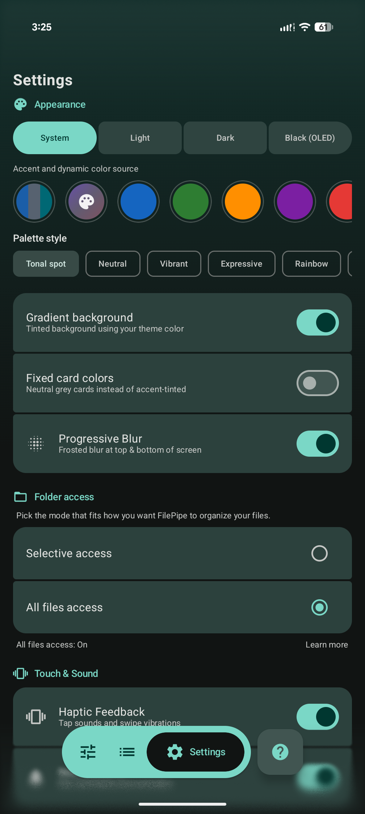
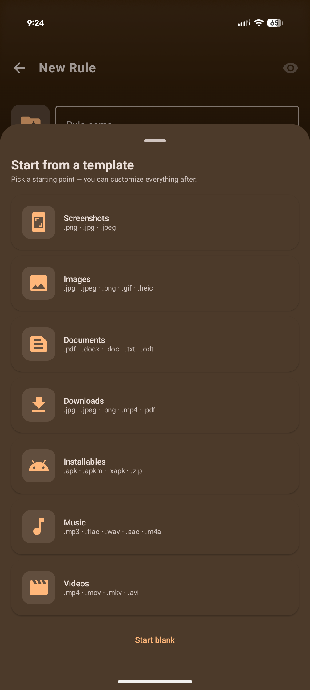
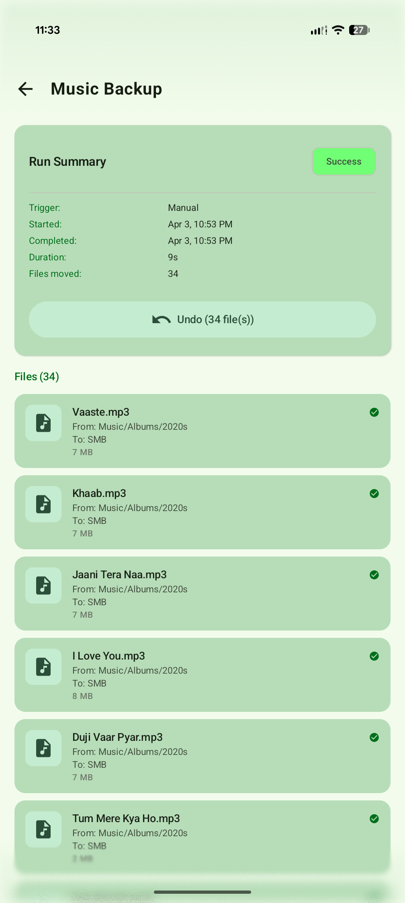

# File Pipe

File Pipe turns your chaotic storage into a perfectly organized library — automatically.

Ever wanted all your videos in one folder, regardless of which app downloaded them? Or wished your Downloads folder would just sort itself into Documents, Music, Images, and everything else?

That's exactly what <b>File Pipe</b> does. Set a rule, pick a schedule, and let the pipes do the work. Move or copy any media to its rightful place.

## ✨ Features

- **Rules** — Create rules with multiple source folders, file extensions, and a destination. Folders can be scanned recursively. Optional **advanced filters** (name pattern, size, age, exclude patterns), **hourly / daily / weekly** schedules, and **custom emoji or icon**.
- **Templates** — Start fast with built-in presets (screenshots, images, video, music, downloads, documents, and more).
- **Move or copy** — Per-rule operation mode, plus conflict handling (skip, overwrite, or rename with a suffix). Copy runs mirror the source subfolder structure at the destination when scanning subfolders.
- **Run your way** — Run rules on demand, **preview** a run to see matches without moving files. **Cancel** a run at any point mid-batch.
- **Manual runs survive backgrounding** — Switching to another app while a manual run is in progress does not interrupt the operation. File Pipe keeps it running and shows a progress notification.
- **Custom rule order** — Sort rules by last ran, name, or your own **drag-and-drop order**. Long-press and drag to reorder.
- **Multi-select** — long-press and hold rule cards to enter multi-select. Select multiple rules and run or delete them together.
- **Notifications** — Scheduled and background manual runs post a progress and summary notification with the filenames that moved and an **Undo** action button.
- **History** — Every run is logged with file details (moved, skipped, failed, cancelled). **Undo** a run when possible. **Filter** by outcome (success, partial, failed, no changes, cancelled, undone), **sort**, and **group** by date, rule, or status.
- **Swipe shortcuts** — Configurable swipe gestures on rule cards (edit, duplicate, delete, preview, history).
- **App shortcuts** — Long-press the launcher icon to run any of your top 4 enabled rules straight from the home screen.
- **Backup** — Export rules to JSON, with optional auto-export on rule change and scheduled export. Import restores everything.
- **Look and feel** — Light, dark, black (OLED), or system-default theme. **Material You** wallpaper colors (Android 12+), 9 fixed accent presets, **custom hex accent colors**, 9 palette algorithms, optional **gradient background**, optional **progressive blur** behind the nav bar (Android 12+), and a **fixed card colors** toggle for neutral grey card surfaces.
- **Updates** — GitHub builds check for updates from this repo's releases; Play Store builds use **Google Play** in-app updates. Auto-check is configurable in Settings.

## 🚀 How to use

1. **Start a new rule** — On the **Rules** tab, tap **Add rule**. Pick a template or start blank, then set the name and icon.

2. **Choose which files** — Add one or more **extensions** (for example `.jpg`, `.mp3`). Optionally expand **Advanced filters** to set a **filename pattern** (wildcards supported), **size / age** limits, or **exclude** patterns.

3. **Choose where** — Add one or more **source** folders and pick a **destination**. Turn on **Scan subfolders** if you want matches inside nested directories, not just the folder root.

   > **Folder access** — File Pipe uses the standard system folder picker. No broad storage permission is required; access is granted folder by folder and remembered.

4. **Choose how** — Set **Move** or **Copy** and how **name conflicts** are handled (skip, overwrite, or rename). Optionally add an **hourly**, **daily**, or **weekly** schedule so the rule runs in the background.

5. **Save, then run** — Tap **Save**. Use **Preview** from the toolbar to see matches before a real run. Run a single rule with its **Play** button, or select multiple rules and tap **Run selected**. A **Cancel** button appears inline while a run is in progress.

6. **History** lists every run; open one for per-file detail, filter by outcome, tap **Undo** to reverse moves (or delete copies) when possible, or tap a moved file to open it directly.

7. **Sort and organise** — Sort rules by last ran, name, or your own order. To set a custom order, switch to **My Order** in the sort menu and drag cards into position.

8. **Customise** — Settings covers theme, palette, custom accent colors, fixed card colors, gradient, blur, haptic feedback, swipe actions, notifications, backup / restore, history retention, and update checks.

---

## 🖼️ Screenshots

<table>
<tr>
<td width="33%" align="center" valign="top">
 
</td>
<td width="33%" align="center" valign="top">
 
</td>
<td width="33%" align="center" valign="top">
 
</td>
</tr>

<tr>
<td width="33%" align="center" valign="top">
 
</td>
<td width="33%" align="center" valign="top">
 
</td>
<td width="33%" align="center" valign="top">
 
</td>
</tr>

<tr>
<td width="33%" align="center" valign="top">
 
</td>
<td width="33%" align="center" valign="top">
 
</td>
<td width="33%" align="center" valign="top">
<video src="https://github.com/user-attachments/assets/31377ddc-ccf0-4583-a558-39b285250d3a" alt="Extensive theming options. Make it your own." width="300" /> 
</td>
</tr>
</table>

---

Made with ❤️ by Bikram Agarwal
