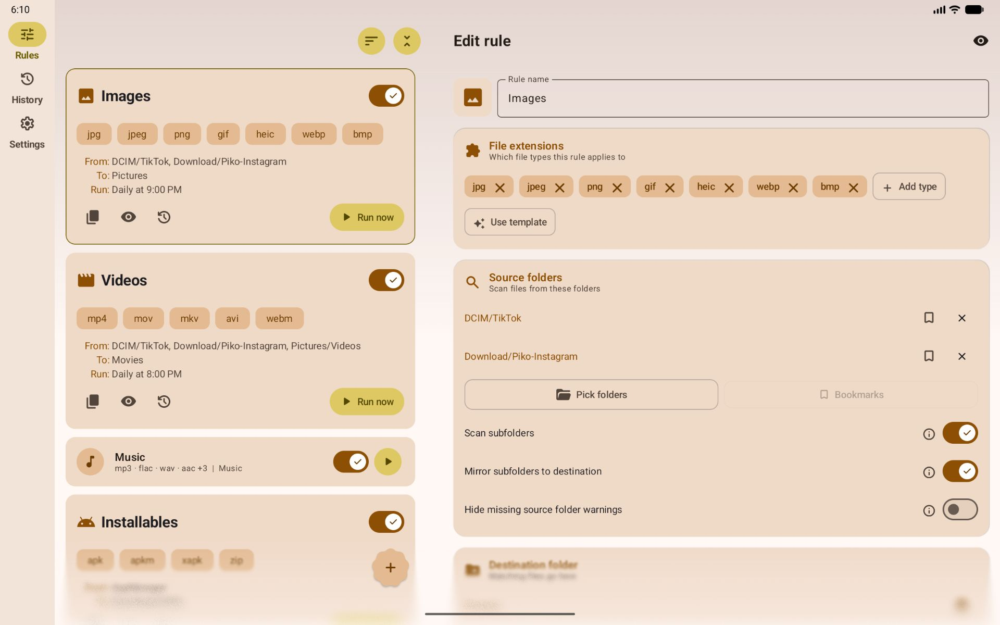
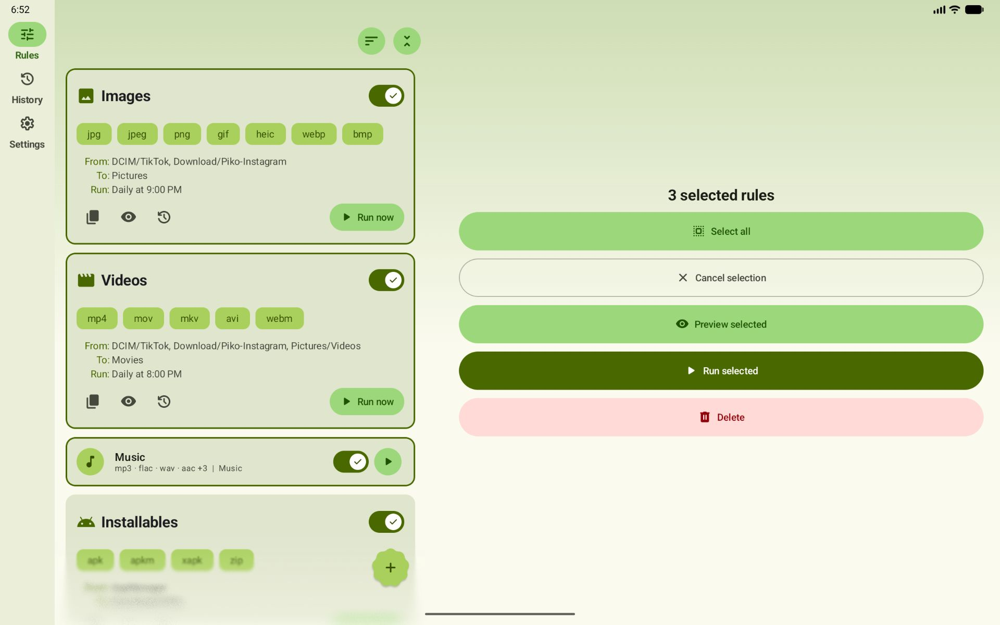
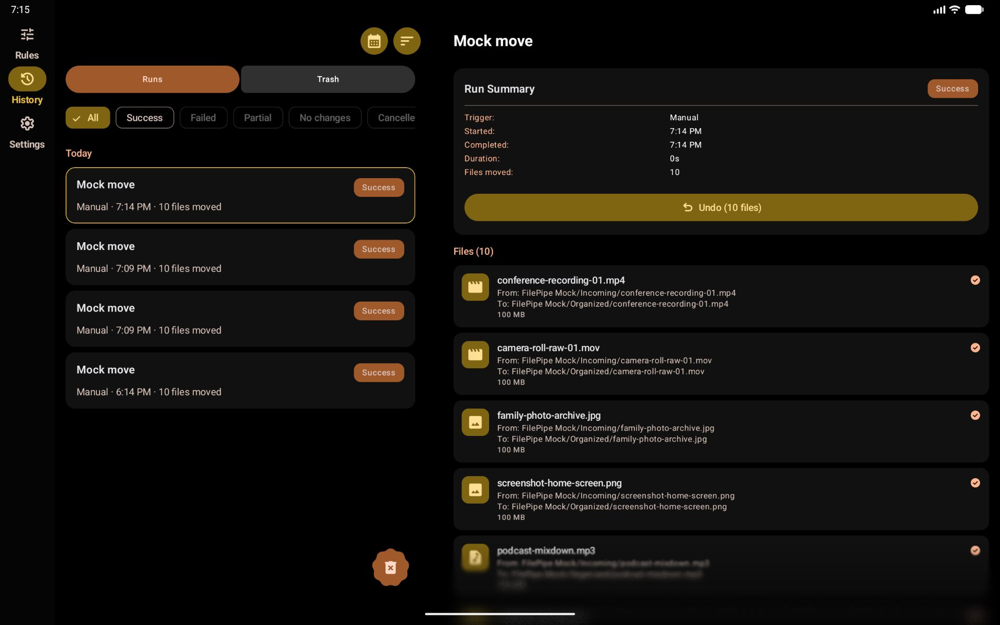
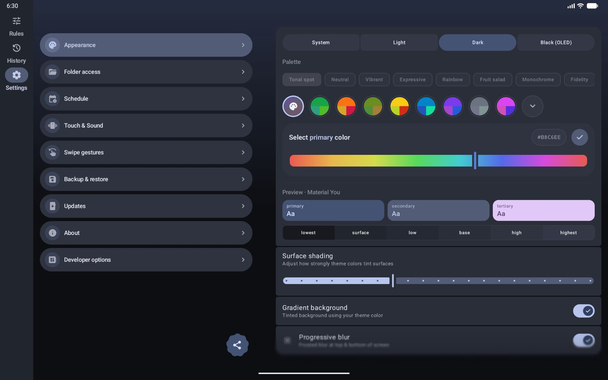

# FilePipe

 

  <!-- Stack / Technical Chips -->
  
  
  
  
   
  <!-- Dynamic Lines of Code Badge -->
  
  <!-- Forks -->
  
  <!-- Stars -->
  
  
   
  <!-- Distribution Badges -->
  
  
  

FilePipe turns your chaotic storage into a perfectly organized library — automatically.

Ever wish your Downloads folder would just sort itself? Or that all your videos would gather in one place regardless of which app saved them?

That's exactly what <b>FilePipe</b> does. Set a rule, pick a schedule, and let the pipes do the work. Move or copy any media to its rightful place.

## 📦 Downloads

## 🛠️ How to use

1. **Choose access mode**: `Selective Access` for granular control or `All Files Access` for ease of use. 
2. **Define the Source**: Pick any folder (or multiple) and decide if you want to scan subfolders.
3. **Choose which files**: Target files by extension, size, age, or advanced name patterns.
4. **Set the Destination**: Choose where the files belong and how to handle name conflicts.
5. **Run Automate**: Run manually on-demand, or set an Hourly, Daily, or Weekly schedule.

## ✨ Key Features

### 📂 Rule-Based Automation

- **Templates**: Get started instantly with presets for screenshots, images, video, music, downloads, documents, and more.
- **Advanced Filtering**: Go beyond extensions with name patterns, wildcards, regular expressions, file size limits, media orientation (portrait/lanscape) and age-based rules.
- **Recursive Scanning**: Deep-dive into subfolders to find every matching file. Optionally mirror folder structure at the destination.
- **Action control**: Choose the action - move, copy or delete. And conflict resolution method - skip, overwrite or rename. 

### ⚡ Power User Workflow

- **Scheduled Job Notifications**: Background jobs post summary notifications with a quick result preview and a one-tap Undo button.
- **Swipe Shortcuts**: Fully configurable gestures on rule cards for quick editing, duplicating, or checking history.
- **Home Screen Shortcuts**: Run your favorite rules instantly with long-press Launcher shortcuts.
- **Backup & Restore/Import**: Export all your rules and settings to local folder or cloud. Support for auto-exports ensures you never lose your setup. Later you can Import or restore it. 

### 📊 Visibility & Control

- **Detailed History**: Every run is logged. Filter by success, failure, or outcome to see exactly what happened. And group by date, rule, or status.
- **Drag-and-Drop**: Organize your rules exactly how you want them with a custom sort order.
- **Batch Actions**: Long-press to enter multi-select mode and preview, run or delete multiple rules at once.
- **Smart Updates**: Built-in smart update checker that detects hotfixes (newer assets) even when the version number stays the same.
- **FAQ & Help**: Searchable help page covering common questions, grouped by topic with deep links into Settings.

### 🛡️ Safety & Reliability (Multiple Fail-Safes)

- **Preview Mode**: See exactly which files will be affected before a single byte is moved. Works in batch mode too.
- **Cancel Mid-Run**: Stop any operation instantly mid-batch if you change your mind.
- **Rule Trash** - Deleted rules go to Trash for 30 days, restore from History.
- **Undo After the Fact**: Made a mistake? Reverse moves or delete copies directly from the history log.
- **Background Resiliency**: Manual runs survive app switching. FilePipe keeps working and keeps you updated via notifications.

### 🎨 Your App, Your Aesthetic

- **Material 3 Expressive**: Light/Dark/OLED themes and dynamic wallpaper-based colors.
- **Total Customization**: 8 preset colors and 9 palette algorithms. Or choose your own color from a slider with live preview. Choice of gradient background and progressive blurs.
- **Visual Personality**: Assign custom icons or emojis to every rule for easy identification.

---

## 🖼️ Screenshots

<table>
<tr>
<td width="33%" align="center" valign="top">
 
</td>
<td width="33%" align="center" valign="top">
 
</td>
<td width="33%" align="center" valign="top">
 
</td>
</tr>

<tr>
<td width="33%" align="center" valign="top">
 
</td>
<td width="33%" align="center" valign="top">
 
</td>
<td width="33%" align="center" valign="top">
 
</td>
</tr>

<tr>
<td width="33%" align="center" valign="top">
 
</td>
<td width="33%" align="center" valign="top">
 
</td>
<td width="33%" align="center" valign="top">
<video src="https://github.com/user-attachments/assets/99e8bd81-65b2-4961-908d-1d8a5a79b981" controls alt="FilePipe Intro." width="300" /> 
</td>
</tr>
</table>

<table>
<tr>
<td width="50%" align="center" valign="top">
 
</td>
<td width="50%" align="center" valign="top">
 
</td>
</tr>

<tr>
<td width="50%" align="center" valign="top">
 
</td>
<td width="50%" align="center" valign="top">
 
</td>
</tr>
</table>

## ⚖️ License & Trademark Notice

The source code of this project is licensed under the GNU General Public License v3.0 (see the [LICENSE](LICENSE) file). 

However, the application names "Remember", "FilePipe", and "ObtainX", along with all original branding artwork, logos, and custom launcher icons, are the exclusive intellectual property and trademarks of the author. Redistribution or modification of the source code under the GPLv3 does not grant permission to use these brand assets in derivative works. All forks must be entirely rebranded.

## ➕ More Apps

<table>
  <tr>
    <td width="50%" align="center">
      <a href="https://github.com/bikram-agarwal/Remember">
        
      <b>Remember</b></a>
      
Notes, tasks, and reminders that keep coming back until they are done.

    </td>
    <td width="50%" align="center">
      <a href="https://github.com/bikram-agarwal/ObtainX">
        
      <b>ObtainX</b></a>
      
A supercharged Obtainium: get Android app updates straight from the source.

    </td>
  </tr>
</table>

---

Made with ❤️ by Bikram Agarwal
